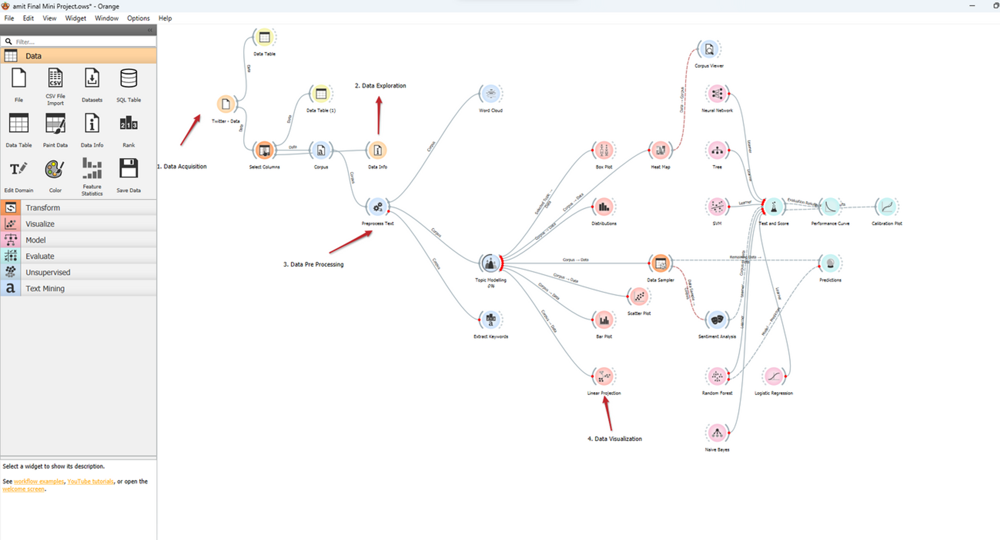

##Sentiment Analysis Tool
Developed Using Orange Data Mining
Overview
The Sentiment Analysis Tool is a machine learning-based application designed to analyze sentiments in textual data, specifically Twitter data. Built using the Orange Data Mining tool, it classifies text into positive, negative, or neutral sentiments. This tool is valuable for businesses, researchers, and policymakers to analyze public opinion and trends efficiently.

Features
User-Friendly Interface – No programming skills required.
Machine Learning-Based – Utilizes logistic regression, Naïve Bayes, and SVM models.
Preprocessing & Feature Extraction – Tokenization, stopword removal, stemming, and TF-IDF.
Real-Time Analysis – Processes live data for sentiment classification.
Visualization – Built-in Orange tools for sentiment trend representation.
Scalability – Can handle large Twitter datasets from Kaggle.
Installation & Requirements
Prerequisites
Orange3 (Download from Orange)
Python 3.x
Required Libraries (if using scripts outside Orange)
nginx
Copy
Edit
pip install pandas numpy nltk scikit-learn
Dataset Source – Twitter datasets from Kaggle.
Usage
Load the dataset – Import Twitter data into Orange.
Preprocess the text – Use text mining widgets for tokenization and stopword removal.
Apply ML models – Train classification models for sentiment analysis.
Analyze results – Use Orange’s visualization tools to interpret data.
Limitations
May struggle with sarcasm, irony, or slang.
Accuracy depends on dataset quality and training parameters.
Future Improvements
Multilingual Support – Extend analysis to multiple languages.
Advanced Deep Learning Models – Integrate transformer-based models.
Cloud Deployment – Enable web-based sentiment analysis.

